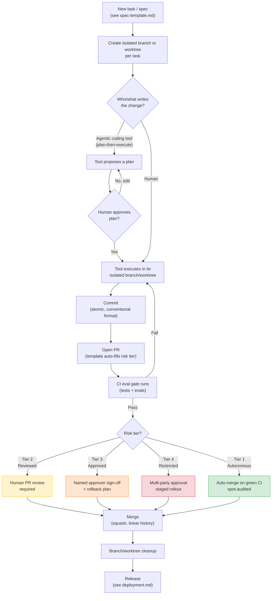

# Git Workflow & Automation Overview

How branching, commits, pull requests, review, and merging work when agentic coding tools are doing a meaningful share of the writing — and what parts of that flow can safely be automated versus what stays human-gated. Read this first; everything else in this repo (specs, risk tiers, practices) plugs into the flow described here.

## The end-to-end flow

The tiers referenced here are the same ones defined in [04-governance-risk-tiers.md](04-governance-risk-tiers.md) — this page is about *where in the git flow* those gates actually apply, not a new classification.

## Branching

**Recommended default: trunk-based, short-lived branches, one branch or worktree per task.**

- Every task — human or tool-initiated — gets its own branch, isolated via [worktree/sandbox isolation](practices/worktree-sandbox-isolation.md) so parallel agentic and human work never collides on the same working tree.
- Keep branches short-lived (hours to a couple of days, not weeks). Long-lived branches are where agentic tools drift furthest from a moving `main` and produce the largest, hardest-to-review merge conflicts.
- Branch naming should encode the risk tier and task reference where practical, e.g. `tier2/feat/search-caching-JIRA-4821`, `tier1/fix/typo-readme` — this lets automation (below) route PRs without re-deriving the tier from scratch.
- Avoid long-lived environment branches (`dev`, `staging`, `release/x`) as a default — they multiply the number of places a tool-authored change has to be re-verified. Use feature flags and short release branches instead where a staged rollout is genuinely needed (Tier 3–4).

## Commits

- **Atomic commits.** One logical change per commit — this is what makes an agentic tool's diff reviewable and revertible in isolation, and what makes `git bisect` useful when something breaks.
- **Conventional commit format** (`feat:`, `fix:`, `refactor:`, `chore:`, etc.) — lets automation (changelog generation, release notes) work off commit history without a separate manual pass.
- **State whether a commit is tool-authored, tool-assisted, or human-authored** in the commit body or a trailer (e.g. `Tool-Assisted: Claude Code`) — this is what makes the [tool-authored change ratio](06-metrics.md) metric computable from git history directly, instead of relying on self-reported tracking.
- Never squash away the plan-then-execute trail during active review — keep the intermediate commits until the PR is approved, squash only at merge time (see below).

## Pull requests

- Every PR uses the [PR template](../.github/PULL_REQUEST_TEMPLATE.md), which requires a declared risk tier and a link to the spec it implements — a PR without both should not be mergeable regardless of who or what opened it.
- PR description should be tool-generated from the diff and the spec by default (see automation below), then human-edited — not written from scratch by a reviewer trying to reconstruct intent after the fact.
- Keep PRs small and scoped to one spec. A tool that drifts outside the spec's stated scope (see [spec-driven-development.md](practices/spec-driven-development.md)) should produce a PR that's easy to spot as oversized, not one that quietly absorbs unrelated changes.

## Review

Review depth is set by risk tier, not by habit — see [code-review.md](03-phases/code-review.md) for the full phase guide. In git-flow terms:

- **Tier 1** — no required human reviewer; branch protection allows auto-merge on green CI, with periodic spot-audits sampled after the fact.
- **Tier 2** — at least one human reviewer required by branch protection rules.
- **Tier 3** — a named, specific approver required (not just "any reviewer") — encode this as a CODEOWNERS entry so it's enforced by the platform, not by convention.
- **Tier 4** — multiple required approvers plus a documented rollback plan attached to the PR before merge is allowed.

## Merge strategy

**Recommended default: squash merge, linear history on `main`.**

- Squash merging keeps `main`'s history at the level of "one entry per shipped change," which is what most of the [metrics](06-metrics.md) in this repo (cycle time, deployment frequency, change failure rate) are actually measuring against.
- Preserve the pre-squash commit trail in the PR itself (GitHub/GitLab keep this automatically) so the plan-then-execute history is still auditable if needed later — squashing for `main` doesn't mean deleting the detail, just not carrying it forward into trunk history.
- Require merge commits to be blocked (no merge-commit strategy) and rebase-before-merge disallowed on shared branches, to avoid an agentic tool rewriting history other in-flight work depends on.

## What agentic tooling can automate here — and what should stay gated

| Git-flow step | Safe to automate | Should stay human-gated |
|---|---|---|
| Branch/worktree creation per task | Yes — mechanical, reversible | — |
| Commit message drafting (conventional format) | Yes | Trailer accuracy (tool-authored vs. assisted) should be spot-checked |
| PR description generation from diff + spec | Yes, as a first draft | Final PR description edit before requesting review |
| Risk-tier labeling on the PR | Yes, tool can propose it from the spec | Human confirms the tier — see the [risk-tier checklist](../templates/risk-tier-checklist.md); never let a tool self-assign its own tier unchecked |
| Running the CI eval gate | Yes — this is what [ci-eval-gate.yml](../.github/workflows/ci-eval-gate.yml) is for | — |
| Merging Tier 1 changes on green CI | Yes | — |
| Merging Tier 2–4 changes | No | Always requires the human/named-approver gate defined above |
| Simple merge-conflict resolution (e.g. rebasing a stale branch against an unrelated file change) | Yes, with the result re-run through CI before merge | A conflict touching the same logical change on both sides — resolve with a human in the loop |
| Changelog / release notes generation from conventional commits | Yes | Final release notes review before a Tier 3–4 release ships |
| Stale-branch/worktree cleanup | Yes | — |
| Branch protection rule changes themselves | No | Changing *the gates* is itself a Tier 3+ action — see [governance-risk-tiers.md](04-governance-risk-tiers.md) |

The general rule, consistent with the rest of this repo: automate the mechanical and reversible parts of the git flow (branch setup, drafting, running checks, cleanup), and keep a human explicitly in the loop wherever the action is hard to reverse or the tool would be grading its own homework (self-assigning risk tier, merging its own Tier 2+ change, or changing the gates that govern it).

## Recommended practices checklist

- [ ] One branch/worktree per task, short-lived, named with risk tier + reference
- [ ] Conventional commit format with a tool-authorship trailer
- [ ] PR template enforced by branch protection (risk tier + spec link required fields)
- [ ] CODEOWNERS mapped to risk tiers for Tier 3 named-approver routing
- [ ] CI eval gate required to pass before any merge, including Tier 1 auto-merge
- [ ] Squash merge only, linear history, no direct pushes to `main`
- [ ] Tier 1 auto-merge enabled with scheduled spot-audits (see [metrics](06-metrics.md) for what to sample)
- [ ] Tier 3–4 branch protection requires multiple named approvers and a documented rollback plan
- [ ] Automated changelog generation wired to conventional commits
- [ ] Automated stale-branch/worktree cleanup on a schedule
