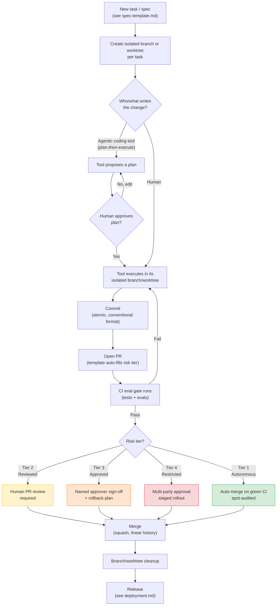

# Git Workflow & Automation Overview

This page explains how branching, commits, pull requests, review, and merging work when agentic coding tools are writing a meaningful share of the code. It also covers which parts of that flow can safely be automated, and which parts need a human in the loop. Read this first — everything else in this repo, including specs, risk tiers, and the individual practices, plugs into the flow described here.

## The end-to-end flow

The tiers shown here are the same ones defined in [04-governance-risk-tiers.md](04-governance-risk-tiers.md). This page isn't introducing a new classification — it's showing where in the git flow those gates actually apply.

## Branching

**Recommended default: trunk-based, short-lived branches, one branch or worktree per task.**

- Every task — whether started by a human or a tool — gets its own branch. It's kept isolated using [worktree/sandbox isolation](practices/worktree-sandbox-isolation.md), so agentic and human work happening at the same time never collides on the same working tree.
- Keep branches short-lived (hours to a couple of days, not weeks). Long-lived branches are where agentic tools drift furthest from a moving `main` and produce the largest, hardest-to-review merge conflicts.
- Where practical, encode the risk tier and task reference in the branch name — for example `tier2/feat/search-caching-JIRA-4821` or `tier1/fix/typo-readme`. This lets the automation described below route PRs without having to re-figure-out the tier from scratch.
- By default, avoid long-lived environment branches such as `dev`, `staging`, or `release/x`. They multiply the number of places a tool-authored change has to be re-verified. Where a staged rollout is genuinely needed — Tier 3 or 4 — use feature flags and short-lived release branches instead.

## Commits

- **Atomic commits.** Keep one logical change per commit. This is what makes an agentic tool's diff easy to review and revert on its own, and it's what makes `git bisect` useful when something breaks.
- **Use conventional commit format** (`feat:`, `fix:`, `refactor:`, `chore:`, and so on). This lets automation — changelog generation, release notes — work directly from commit history, without a separate manual pass.
- **State whether a commit is tool-authored, tool-assisted, or human-authored**, either in the commit body or in a trailer (for example, `Tool-Assisted: Claude Code`). This is what lets the [tool-authored change ratio](06-metrics.md) metric be computed straight from git history, instead of relying on someone tracking it separately.
- Don't squash away the plan-then-execute trail while a PR is still under active review. Keep the intermediate commits until the PR is approved, and squash only at merge time (see below).

## Pull requests

- Every PR uses the [PR template](../.github/PULL_REQUEST_TEMPLATE.md), which requires a declared risk tier and a link to the spec it implements. A PR missing either one shouldn't be mergeable, no matter who or what opened it.
- By default, the PR description should be generated by a tool from the diff and the spec (see the automation table below), then edited by a human. It shouldn't be written from scratch by a reviewer trying to reconstruct the original intent after the fact.
- Keep PRs small and scoped to a single spec. If a tool drifts outside the spec's stated scope (see [spec-driven-development.md](practices/spec-driven-development.md)), the resulting PR should be easy to spot as oversized — not something that quietly absorbs unrelated changes without anyone noticing.

## Review

How deeply a change gets reviewed is set by its risk tier, not by habit. See [code-review.md](03-phases/code-review.md) for the full phase guide. In terms of the git flow:

- **Tier 1** — no required human reviewer; branch protection allows auto-merge on green CI, with periodic spot-audits sampled after the fact.
- **Tier 2** — at least one human reviewer required by branch protection rules.
- **Tier 3** — a specific, named approver is required, not just "any reviewer." Encode this as a CODEOWNERS entry, so it's enforced by the platform itself rather than by convention.
- **Tier 4** — multiple required approvers plus a documented rollback plan attached to the PR before merge is allowed.

## Merge strategy

**Recommended default: squash merge, linear history on `main`.**

- Squash merging keeps `main`'s history at the level of one entry per shipped change. That's what most of the [metrics](06-metrics.md) in this repo — cycle time, deployment frequency, change failure rate — are actually measured against.
- Preserve the pre-squash commit trail in the PR itself — GitHub and GitLab keep this automatically — so the plan-then-execute history stays auditable if you need it later. Squashing for `main` doesn't mean deleting that detail. It just means not carrying it forward into trunk history.
- Block merge commits (disallow the merge-commit strategy) and disallow rebase-before-merge on shared branches. This avoids an agentic tool rewriting history that other in-flight work depends on.

## What can be automated, and what needs a human

| Git-flow step | Safe to automate | Should stay human-gated |
|---|---|---|
| Branch/worktree creation per task | Yes — mechanical, reversible | — |
| Commit message drafting (conventional format) | Yes | Trailer accuracy (tool-authored vs. assisted) should be spot-checked |
| PR description generation from diff + spec | Yes, as a first draft | Final PR description edit before requesting review |
| Risk-tier labeling on the PR | Yes, tool can propose it from the spec | Human confirms the tier — see the [risk-tier checklist](../templates/risk-tier-checklist.md); never let a tool self-assign its own tier unchecked |
| Running the CI eval gate | Yes — this is what [ci-eval-gate.yml](../.github/workflows/ci-eval-gate.yml) is for | — |
| Merging Tier 1 changes on green CI | Yes | — |
| Merging Tier 2–4 changes | No | Always requires the human/named-approver gate defined above |
| Simple merge-conflict resolution (e.g. rebasing a stale branch against an unrelated file change) | Yes, with the result re-run through CI before merge | A conflict touching the same logical change on both sides — resolve with a human in the loop |
| Changelog / release notes generation from conventional commits | Yes | Final release notes review before a Tier 3–4 release ships |
| Stale-branch/worktree cleanup | Yes | — |
| Branch protection rule changes themselves | No | Changing *the gates* is itself a Tier 3+ action — see [governance-risk-tiers.md](04-governance-risk-tiers.md) |

The general rule here is the same one used throughout this repo. Automate the mechanical, reversible parts of the git flow — branch setup, drafting, running checks, cleanup. Keep a human explicitly involved wherever an action is hard to reverse, or wherever the tool would effectively be grading its own homework — assigning its own risk tier, merging its own Tier 2-or-higher change, or changing the gates that govern it.

## Recommended practices checklist

- [ ] One branch/worktree per task, short-lived, named with risk tier + reference
- [ ] Conventional commit format with a tool-authorship trailer
- [ ] PR template enforced by branch protection (risk tier + spec link required fields)
- [ ] CODEOWNERS mapped to risk tiers for Tier 3 named-approver routing
- [ ] CI eval gate required to pass before any merge, including Tier 1 auto-merge
- [ ] Squash merge only, linear history, no direct pushes to `main`
- [ ] Tier 1 auto-merge enabled with scheduled spot-audits (see [metrics](06-metrics.md) for what to sample)
- [ ] Tier 3–4 branch protection requires multiple named approvers and a documented rollback plan
- [ ] Automated changelog generation wired to conventional commits
- [ ] Automated stale-branch/worktree cleanup on a schedule
